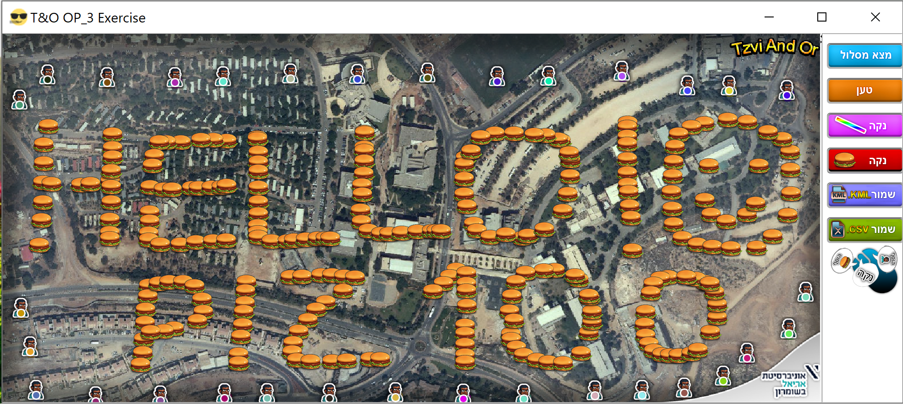
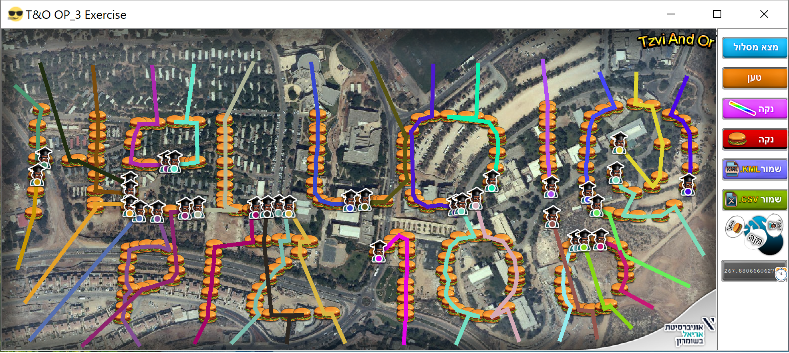
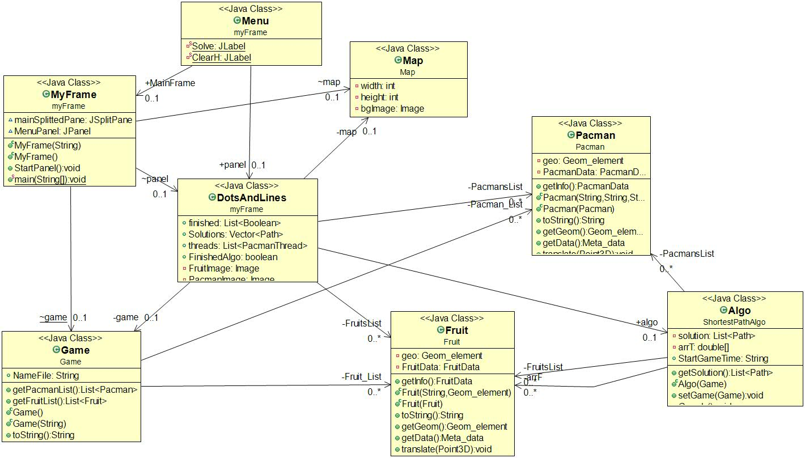
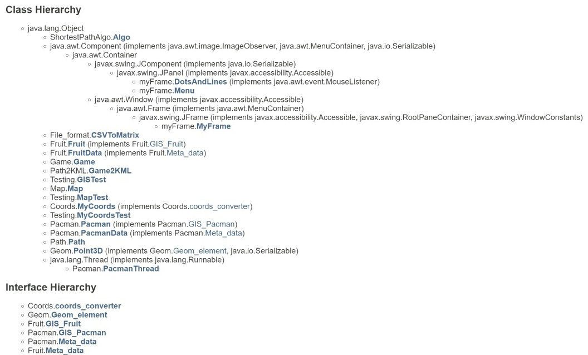
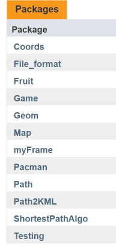
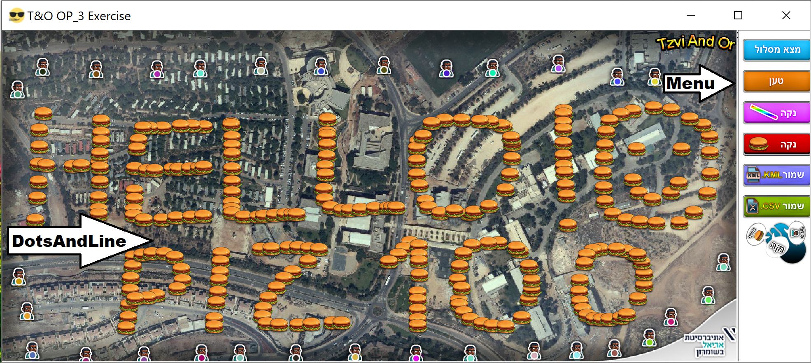
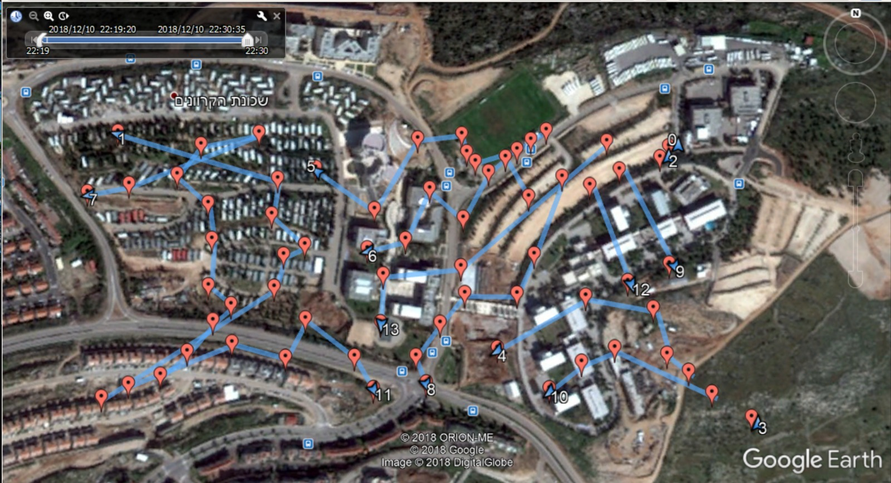
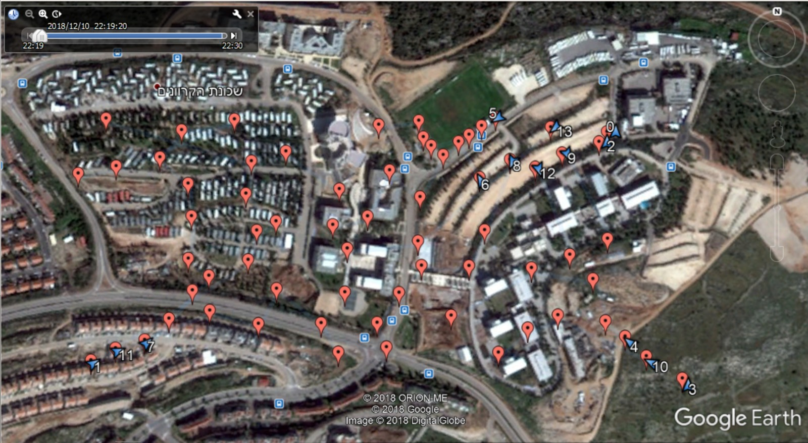

<h1>OOP Ex3</h1>

Created during a computer communication course during the second year at Ariel University in the Department of Computer Science, 2018   <strong>Project site:</strong>&nbsp;<a href="https://zvimints.github.io/OOP_3/.">https://zvimints.github.io/OOP_3/.</a>  <strong>Made by: </strong><a href="https://github.com/ZviMints">Zvi Mints</a> and <a href="https://github.com/orabu103">Or Abuhazira</a>

<h1>About The Project:</h1>
<table style="height: 206px;" width="599">
<tbody>
<tr>
<td style="width: 290.667px;"></td>
<td style="width: 292.667px;"></td>
</tr>
</tbody>
</table>

<strong>Problem:</strong> Given a .csv file with pecans and fruits find a minimal optimal greedy path by the time such that the Pacmans will pass through all the fruits in the map This project represents a greedy solution to the <strong>problem.</strong>

<h1>Project Diagram:</h1>

<h1>Class Hierarchy:</h1>

<h1>Packages:</h1>

&nbsp;So let's start!

<h1>MyFrame:</h1>

MyFrame package&nbsp;is divided into 2 classes

the first "<strong>Menu</strong>" class is the Menu class that represents the GUI of the side Menu in the right side, the second "<strong>DotsandLines</strong>" class is the Game Panel that represents the Game in the left side.

<h1>Coords:</h1>

This Class is responsible for actions between Objects of the kind Point3D. The Class is used to Provide a solution for elementary actions between vectors and points in R^3 Vector space.

<h1>File_format:</h1>

File_format This package is divided into 2 classes.

<ul>
<li><strong>CSVToMatrix: </strong> This class is responsible to make Dynamic matrix[][].</li>
<li><strong>Game2KML: </strong> This Class Game Object into KML file.</li>
</ul>
<h1>Fruit :</h1>

Fruit This Class represent Fruit that implements GIS_Fruit. Every Fruit has FruitData which include relevant information about the Fruit such that ID, Also Geom Element which represent the location of the Fruit in [Lat, Lon, Alt] coords. Each Fruit was created through Runtime of <strong>Game</strong> Class.

<h1>Pacman&nbsp;:</h1>

Pacman This Class represent Pacman that implements GIS_Pacman. Every Pacman has PacmanData which include relevant information about the Pacman such that ID, Speed, Radius, Color and Time.

<ul>
<li><strong>Note: </strong>Time used to represent The total time of the Pacman's walk in the chosen route by the Algorithm.</li>
</ul>

Also, Geom Element which represents the location of the Fruit in [Lat, Lon, Alt] coords. Each Pacman was created through Runtime of <strong>Game</strong> Class.

<ul style="list-style-type: square;">
<li>Each Pacman have Pacman thread the represent the movement of the Pacman by real time in the Game Panel, each thread is responsible to transfer himself to the destination point by the vector that in the current Path</li>
<li>we can change the "real-time" running algorithm by the time that each thread will <strong>sleep</strong></li>
</ul>
<h1>Map:</h1>

This class can convert Pixel point to Geo Point and back.

Each map containst Map Map (Image) that represent the background of the Game.

<h1>Path:</h1>

Each path has relevant information about a path between 2 Points in R^3.

Each path has the <strong>coordinates</strong>&nbsp;of source port and destination&nbsp;port.

In addition, the path contains the <strong>vector</strong> and the <strong>time</strong> that the path is taking to a Pacman, we can know which Pacman take which path by the <strong>ID</strong> that the path is saving, each path have a <strong>color</strong> that set up by Pacman color.

<h1>Game:</h1>
<ul>
<li><strong>Game:&nbsp;</strong>This class represent Game which include Fruits List and Pacmans List, this class can init Pacmans and Fruits from Matrix.</li>
<li><strong>GameToCSV:&nbsp;</strong>This Class Converting Game into CSV file.</li>
</ul>
<h1>Path2KML:</h1>
<ul>
<li><strong>Game2KML:&nbsp;</strong>This Class Converting Game into KML file.</li>
</ul>

This package is responsible to convert from a game that has been runned by the algorithm and make a valid. KML file that shows the path's of each Pacman

<strong>Example:</strong>

<table style="height: 206px;" width="599">
<tbody>
<tr>
<td style="width: 290.667px;"></td>
<td style="width: 292.667px;"></td>
</tr>
</tbody>
</table>
<h1>Algorithm:</h1>

The algorithm of the project a greedy algorithm:

<strong>Problem:</strong> for input number of pacmans and the input number of fruits we want to find the minimum route time such that all fruit will be eaten by the pacmans.

<strong>Solution:</strong>&nbsp; (Pseudo code)

<strong>GreedyAlgorithm(Game game)</strong>

1. Init all pacmans time to 0

2. While fruit list is not empty

3.&nbsp; &nbsp; &nbsp; &nbsp;for each Pacman find the closest fruit to him by time, enter the value to the array

4.&nbsp; &nbsp; &nbsp; &nbsp;find the minimum time in the array as a function of (current pacman time + time to next fruit)

5.&nbsp; &nbsp; &nbsp; &nbsp; move Pacman to (Fruit - Pacman radius) point, update all the fields and add path to the solutions

6.&nbsp; &nbsp; &nbsp; &nbsp; remove Fruit from the fruit list

<strong>Complexity:</strong> O(|F| * |P| * |F| )

<h1>Junit Testing:</h1>
<ol>
<li>GameTest: Testing the Game Package.</li>
<li>Map Test: Testing the Map Package.</li>
<li>MyCoords Test: Testing the Coords package.</li>
</ol>

&nbsp;

